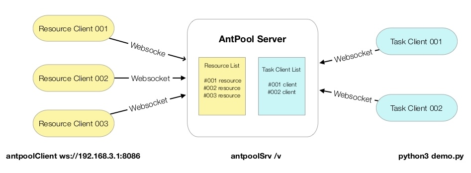

# AntPool - 基于 Python 的极简多机分布式计算框架

## What
- AntPool 提供服务器、资源客户端运行程序, 让你可简单、快速搭建起由多台计算机组成的分布式运行环境;
- AntPool 提供一个与 Python 原生 concurrent.futures.Executor 异步执行库一致的开发库，让你可以快速将你的代码部署在多机分布式环境中运行;

## Why 
- 在某些应用场景下, 我们希望程序能够并行运行在多台机器上，以便获得**性能、网络访问能力**提升;
	- **计算性能提升**: 用 Python 进行一些复杂的计算、分析工作，Python由于GIL原因, 多线程在计算密集场景无法发挥多核CPU效能，因此 Python 推出了 concurrent.futures.ProcessPoolExecutor 对象, 能方便的实现多进程开发; 但当需要更高性能时, 多机分布式运行环境可快速地让你只改动几行代码, 将性能提升到新的高度。
	- **网络能力提升**: 在互联网上抓取数据, 并对数据进行分析、提取, 但往往会受被抓取服务器的流量限制。因此需将程序部署到多台不同网络地址的机器进行抓取, 手工进行这些操作很繁琐、容易出错, 多机分布式运行环境能快速解决这类问题。
- **人人能用的多机分布式计算**, 而非需要复杂配置、专业设备、重新学习如何开发。
	- 任何一台设备就可以作为服务器 或 资源客户端, 或两者运行在一起。 这些设备包括 PC/Mac/Linux电脑, 甚至包括你的 iPhone/iPad 等能够运行 Python 环境的设备。
	- 你可以在家里, 将你的所有设备利用起来, 帮助你提升计算性能; 你也可以让公司的同事将部分CPU内核贡献出来帮你实现复杂计算。
	- 所有的计算资源通过运行 资源客户端 来接入服务器维系的集群网络, 可以灵活的加入、退出。
	- 无需学习新的概念，因为你只需要理解 Python 原生的 concurrent.futures.Executor 就可以了, 因为 AntPool 的类与此完全一致。
- **移动设备支持**, iPad是很好的工具，已经有很多优秀的应用可以运行 Python 和 iPython Notebook, 但是由于 iOS 的安全限制, 很多库无法安装, 并且无法支持多进程运行, 借助 AntPool 可以在 iPad 上直接调用部署好的多机集群，在集群上运行那些无法在 iPad 上实现的功能或获取更大性能。
	- iPad Python 支持应用
		- Pythonista (需要安装 [stash](https://github.com/ywangd/stash) 以便支持pip)
		- Pyto
		- CodeApp
	- iPad iPython Notebook / Jupyter 支持应用
		- Juno
		- Carnets

## How
- 运行环境要求: 
	- Python 3.5 或以上版本
- 快速尝试:
	- **pip3 install antpool**
	- 单机部署服务器和资源客户端
		- 在终端环境下运行: **antpoolsrv /v**
		- 新开一个终端运行: **antpoolclient ws://127.0.0.1:8086**
		- 如果需要接入更多的资源客户端, 提升集群性能, 可以在其它机器上:
			- **pip3 install antpool**
			- **antpoolclient ws://服务器IP:8086**
		- 同一台机器上, 每运行一个 antpoolclient 客户端, 会对应使用一个CPU内核, 因此如果希望发挥整台机器性能, 可以运行多个客户端(例如: 4核CPU 的机器, 可以运行4个客户端)
	- 运行 Demo 程序
		- **python3 demo1.py**  (demo.py 在github.com/wolf71/AntPool/demo可以找到)
	- 结构图
	

## !!! 安全提示 !!!
- 资源客户端负责对提交的模块进行执行, 因此运行资源客户端的设备将可能会受到不良目的的使用者的攻击, 目前系统并为对执行模块进行安全检测, 因此建议运行资源客户端的用户需要确认使用者是否值得信任;
- 考虑到简洁性, 目前整个系统都没有采用授权用户/密码认证机制 (代码中预留了接口); 因此建议服务器部署在公网时注意安全;

## 使用说明
### 1. AntPool 服务器
- **antpoolSrv port /s /v**
	- port: Websocket 端口号, 默认值 8086
	- /s 开启 websocket SSL 支持
	- /v 调试模式, 将输出调试信息到屏幕上, 如果不开启调试模式, 所有提示信息/错误信息将写入日志文件
		- 日志文件: aSrv_log.txt
		- 错误信息: aSrv_err.txt
	- 一个多机并行计算环境只需要运行一个服务器端程序
- **Web 监控**
	- 打开浏览器, 输入 http://xxx:port/antadmin  监控服务器信息(当前资源客户端连接状态, 当前任务客户端状态)
- SSL 配置
	- 生成 SSL keys (使用 Tornado 来支持 SSL 相较于用 Nginx 进行转发支持慢不少, 建议采用 Nginx SSL 转发方式)
		- openssl genrsa -out privkey.key 2048
		- openssl req -new -x509 -key privkey.key -out cacert.csr -days 1095
		- 将生成的两个文件复制到 antpoolSrv.py 相同目录, 而后用 /s 参数启动服务器

### 2. AntPool 资源客户端
- **antpoolClient server_addr**
	- server_addr: AntPool 服务器 websocket 地址, 例如 ws://192.168.3.3:8086 或 wss://srv1.mycorp.com:8086 (SSL 开启模式)
	- 默认是 ws://127.0.0.1:8086
- 你可以在同一台机器上运行 antpool 服务器 和 资源客户端, 资源客户端可以运行多个（一般而言一个物理CPU对应一个资源客户端是合理的配置)
- 你可以在不同的设备上运行资源客户端, 只需要将地址都指向同一个服务器, 这样可以扩充整个服务器集群的性能。资源客户端可随时加入/退出集群。

### 3. 使用 AntPool.AntPoolExecutor 开发你的应用
- 请先阅读 Python concurrent.futures 的说明文档
	- https://docs.python.org/zh-cn/3/library/concurrent.futures.html （中文版)
- AntPool.AntPoolExecutor 兼容 Python concurrent.futures 
	- 多线程使用python的 concurrent.futures.ThreadPoolExecutor
	- 多进程使用python的 concurrent.futures.ProcessPoolExecutor
	- 多机并行计算使用AntPool的 AntPool.AntPoolExecutor
- AntPool.AntPoolExecutor
	- **AntPoolExecutor(srvurl, max_workers=8, rtype = 0, user='user',pwd='pwd')**
  	- srvurl: antpool 服务器地址, 例如: ws://127.0.0.1:8086
    - max_workers: 设置最大并行处理数 (默认值 8)
    - rtype: 运行模式(默认值 0) 0- global/local 运行环境在函数运行前被复位; 1-函数运行完后 g/l 环境变量被复位; 2-g/l 持续保持不复位
		- user/pwd: 保留, 当前版本未使用
	- **AntPoolExecutor.submit**(fn, *args, **kwargs)
		- 将 fn(*args, **kwargs) 函数送往集群服务器执行, 返回 Future 对象, 该对象具有以下方法
			- result(timeout=None) 返回方法的返回结果 (阻塞, 直到返回结果或超时)
			- add_done_callback(fn) 添加一个 callback 函数
	- AntPoolExecutor.map(func, *iterables, timeout=None, chunksize=1)
	- AntPoolExecutor.shutdown(wait=True) 关闭服务,释放资源。可通过对每个线程或进程执行join()方法来释放资源；也可通过使用 with 语句来避免使用这个方法。

### 4. 给我看看你的代码
```python
# import AntPoolExecutor
from AntPool import AntPoolExecutor

# 设置 服务器 地址
srv = 'ws://127.0.0.1:8086'

#
# 你的并行运行函数
#
def test(n):
  # 在这里 import 函数需要用到的库
  from random import random
  # 需要并行处理的代码写在这里
  cnt = 0
  for i in range(1, n+1):
    cnt += i
  # 返回结果
  return cnt

# 并行计算次数
r_n = 20 

# 使用 AntPoolExecutor.map 进行多机分布式并行计算
with AntPoolExecutor(srv) as executor:
  # 将任务发送给服务器, 并行计算后异步获取计算结果
  r = executor.map( test, [20000000 for i in range(r_n)] )
  # 将结果进行累加 (r 是一个列表)
  print('### %d times, total = %d'%(r_n, sum(r)))
```

## 开发背景与历史
- 基于快速抓取网络数据, 需用多台机器/多个IP进行快速并行处理这个需求, 2015/10 月完成了初始版本, 并完成并行数据抓取/处理工作。（初始版本基于 Python2 / Tornado / callback 模式)
- 2021/2 完成 Python3 改造, 并且弃用 callback 模式, 更改为与 python 原生 concurrent.futures 一致接口; 并且增加了 web 状态监测功能。